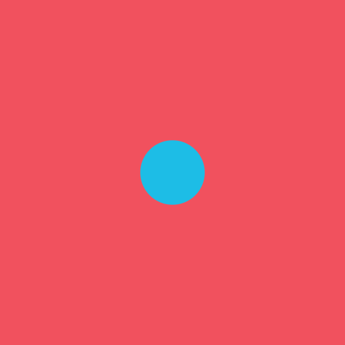
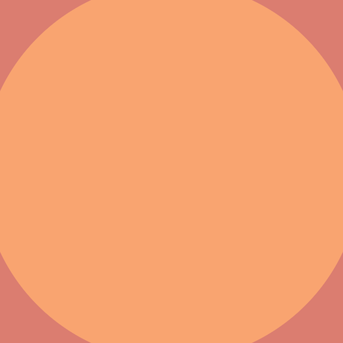

# everything becomes nothing 

A circle grows then shrinks, as the color of the background and the color of the ball cycle through three colors. One of five color palettes will be chosen at random. 

	
	

	
	
	

alexthescott - 1/21/21