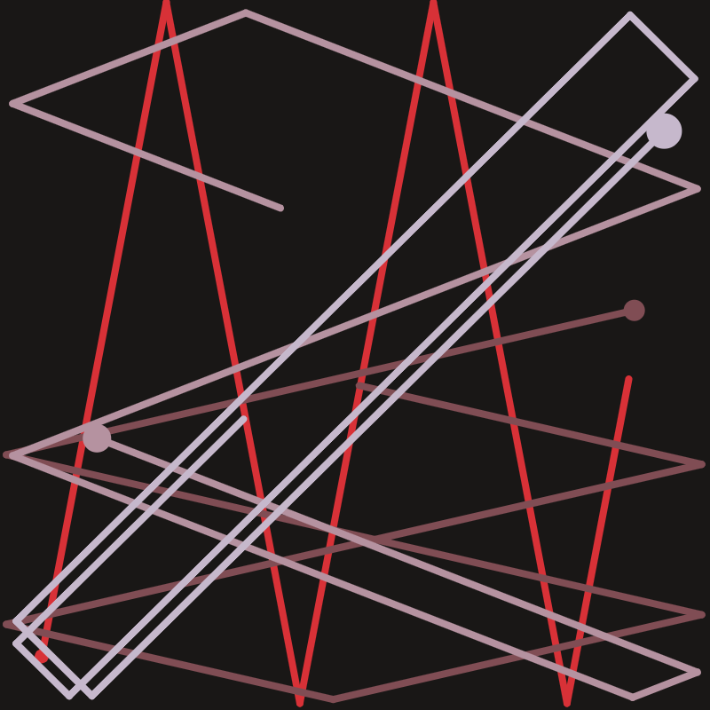

# P5.js sketches

 [everything becomes nothing](https://github.com/alexthescott/p5.js-sketches/tree/main/1_21_20_everything_becomes_nothing)
---
 [bounce path](https://github.com/alexthescott/p5.js-sketches/tree/main/1_15_20_bounce_path)
---
