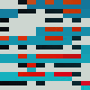

# Sketches
---
 [rain_orbit](https://github.com/alexthescott/graphic_sketches/tree/main/rain_orbit)     
---
 [grayscale triangles](https://github.com/alexthescott/graphic_sketches/tree/main/grayscale_triangles)   
---
 [carpet noise](https://github.com/alexthescott/graphic_sketches/tree/main/carpet_noise)    
---
 [boxes front matt](https://github.com/alexthescott/graphic_sketches/tree/main/boxes_front_matt)     
---
 [circle rain sin](https://github.com/alexthescott/graphic_sketches/tree/main/circle_rain_sin)      
---
 [concentric_shuffle](https://github.com/alexthescott/graphic_sketches/tree/main/concentric_shuffle)   
---
 [worm_noise](https://github.com/alexthescott/graphic_sketches/tree/main/worm_noise)  
---
 [tiny_noise](https://github.com/alexthescott/graphic_sketches/tree/main/tiny_noise)   
---
 [random_walk](https://github.com/alexthescott/graphic_sketches/tree/main/random_walk)   
---
 [germ_grid](https://github.com/alexthescott/p5.js-sketches/tree/main/germ_grid)   
---
 [pond_water](https://github.com/alexthescott/graphic_sketches/tree/main/pond_water)     
---
 [everything becomes nothing](https://github.com/alexthescott/graphic_sketches/tree/main/everything_becomes_nothing)   
---
 [bounce path](https://github.com/alexthescott/graphic_sketches/tree/main/bounce_path)  
---
