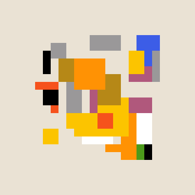
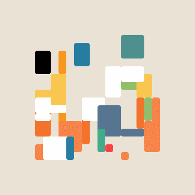
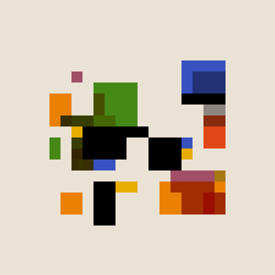
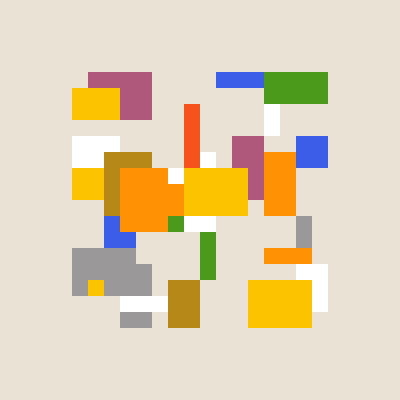
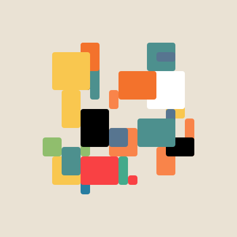
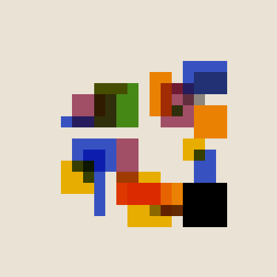

# boxes front

A recreation of [Matt DesLauries's](https://twitter.com/mattdesl) [boxes from the front](https://twitter.com/mattdesl/status/1396876632594554887). 400 by 400 pixels, 16 by 16 squares, with 32 shapes spawned size (1, 4), (1, 4). Coin flip for Matt's palette, and my alternative palette. 25% chance for a squircle, and 20% chance for an alternate blending mode 

	
	
	

	
	
	

alexthescott - 5/28/21