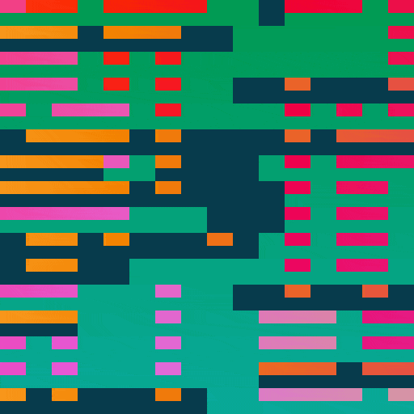
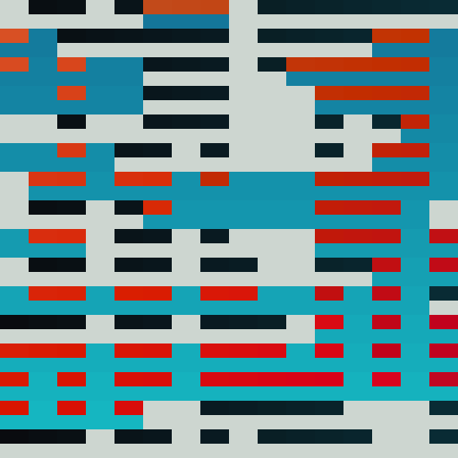
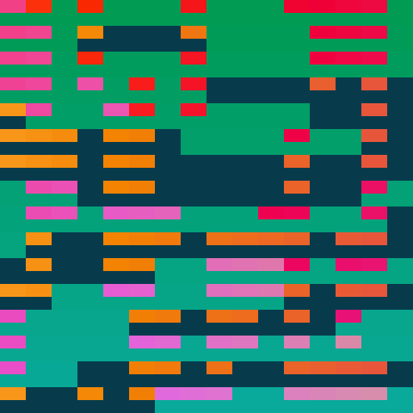
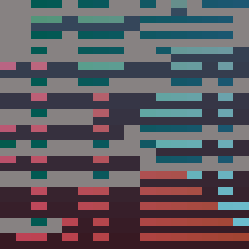

# [carpet noise](https://openprocessing.org/sketch/1220973)

Two layers of perlin noise, represented with chunky squares, with the blend mode difference applied. Three palettes possible, click on the sketch to get a different palette, and new noise seed.

	
	

	
	
	

alexthescott - 6/18/21