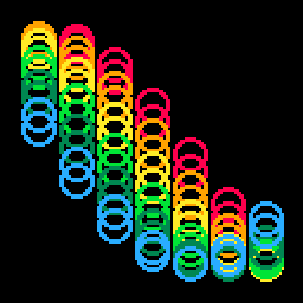

# [circle rain sin](https://openprocessing.org/sketch/1176290)

A vertical version of this [BeesandBombs sketch](https://twitter.com/beesandbombs/status/1385611174704713728). Circles are moved in the y axis by a sin function, with an offset for circles in both the x and y axis. Colors are predetermined, [screen](https://en.wikipedia.org/wiki/Blend_modes#Screen) blend mode.

I also made a Pico8 demake of the same sketch. It is the second gif presented below.

	
	

alexthescott - 4/24/21