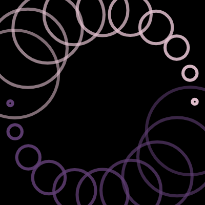
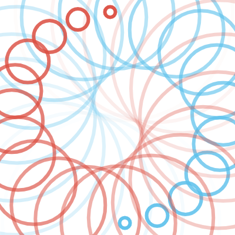

# fishes 

2 or 3 'fishes' spin in a circle, leaving ripples which fade over time. 6 color palettes are available, chosen at random, half with white background, and half with black background.  

	
	

	
	
	
	

alexthescott - 1/26/21