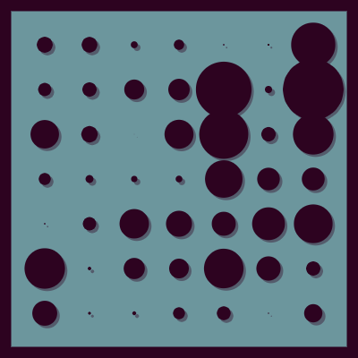
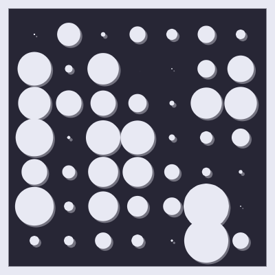
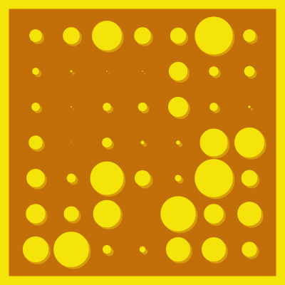
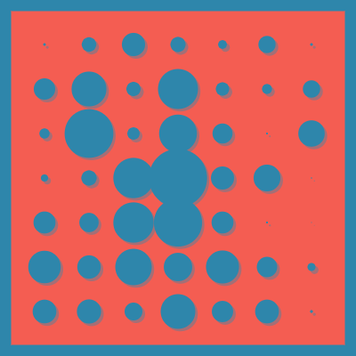

# germ grid 

Thanks to polar coordinates, and 2D perlin noise, germ grid is a perfect random repeating loop. A grid of circles and shadows are drawn, and change size given position in noise space. 6 colors to randomly choose from, with a coin flip to determine if the background and element colors should be flipped. This is a variation on [this](https://www.openprocessing.org/sketch/780000) sketch by [LeithBA](https://leithba.com/).

	

	
	
	
	

alexthescott - 1/31/21