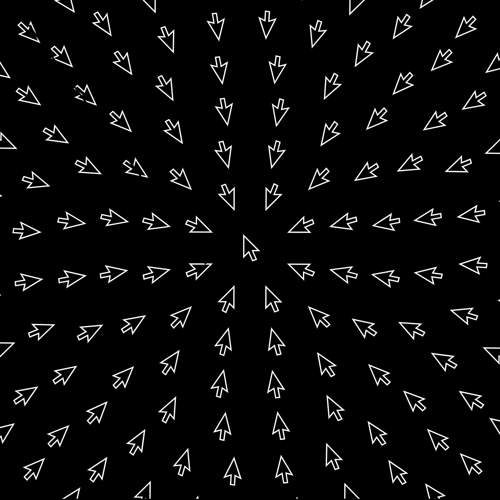

# [mouse study 01](https://openprocessing.org/sketch/1811489)

rings of mouses pointed towards the center mouse rotate given perlin noise as an input. The rotations move from the outside rings towards the center rings

	

	

alexthescott - 23/1/29