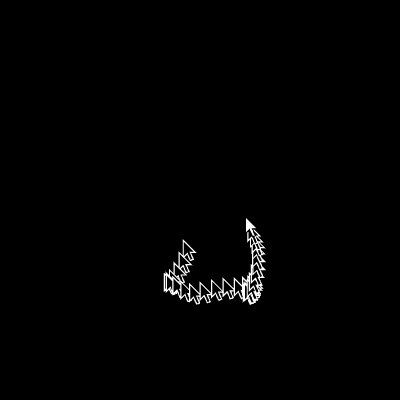
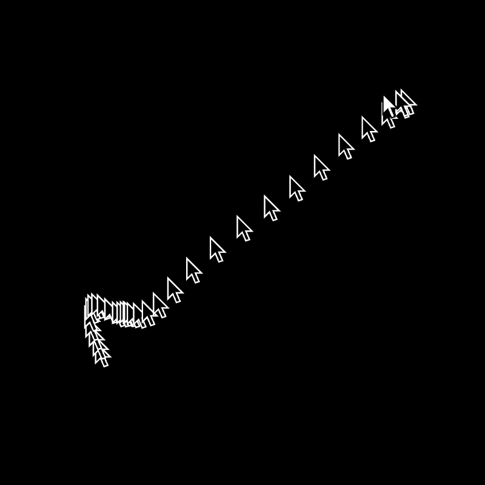

# [mouse study 02](https://openprocessing.org/sketch/2059120)

A white mouse is moved with noise as black mouses with a white outline follow closely behind. The speed of the movement oscillates between slow and slower.

	

	

alexthescott - 23/10/24