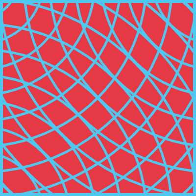
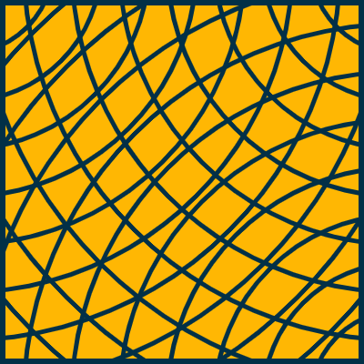
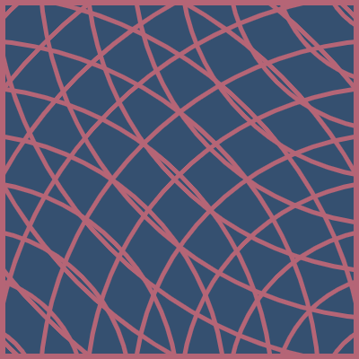
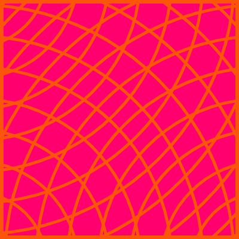

# [pond water](https://www.openprocessing.org/sketch/1085278) 

3 corner points emanate ripples at a slow rate. 6 color palettes are available, the background and ripple color can be flipped upon initialization. [Dave Whyte](https://dribbble.com/shots/3450541-Ripples) did it first! 

	
	

	
	
	
	

alexthescott - 1/28/21