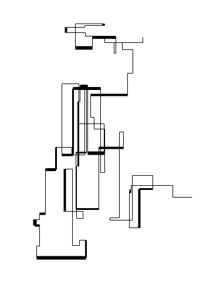
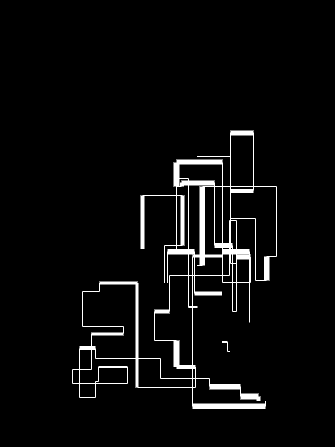
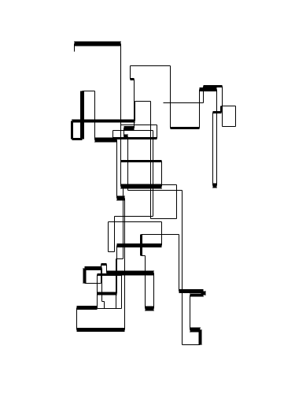
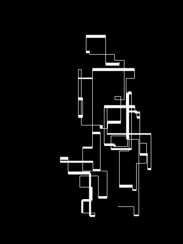

# [Random Walk](https://www.openprocessing.org/sketch/1086564) 

A recreation of Manfred Mohr's 1969 P-10 "[Random](http://www.emohr.com/sc69-73/p10_one.gif) [Walk.](http://www.emohr.com/sc69-73/p10_two.gif)" A random walk of 100 alternating horizontal and vertical lines within an enclosed space is shown. The horizontal lines have a high percentage of a thicker width. The two drawings above show a continuous path, where lines change direction when they hit an edge of the space. Found [here](http://www.emohr.com/manfred7.html) under early algorithms 1969-1973.

	
	

	
	
	
	

alexthescott - 2/2/21