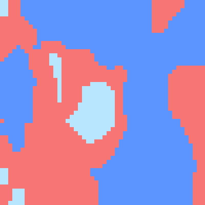
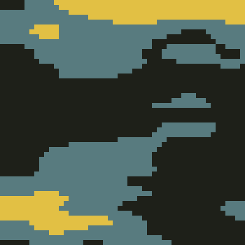
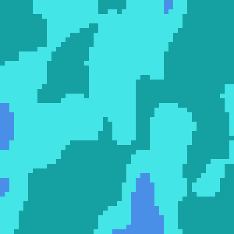
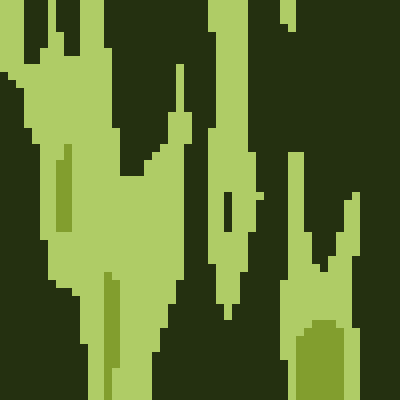
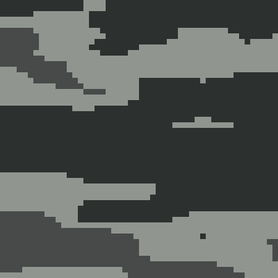
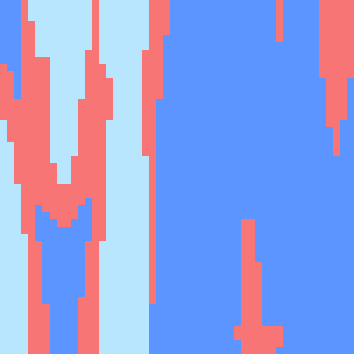

# [Tiny Noise](https://openprocessing.org/sketch/1154224)

A tricolored representation of [perlin noise](https://en.wikipedia.org/wiki/Perlin_noise) in 2D. 1 of 6 color palettes is chosen, and the third dimension of the perlin space is the sum cos(n) and sin(n), allowing for a perfect gif loop. This is why the gifs 'dance' with each other.

	
	
	

	
	
	
	

 

alexthescott - 2/27/21