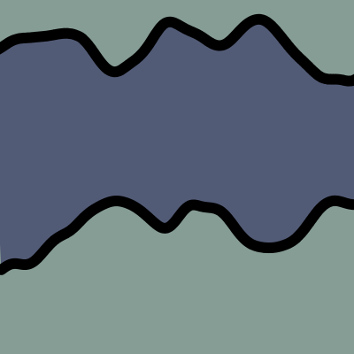

# Worm Noise

Scrolling through [perlin noise](https://en.wikipedia.org/wiki/Perlin_noise) in 3D, to create a noisy worm shape. The 2nd and 3rd dimension are used to sample noise values in a circle, creating a perfict gif loop. 1 of 6 color palettes is chosen, and a coin flip determines if the bg and fill color should be swapped.

	
	
	
	

	
	
	
	

alexthescott - 3/20/21